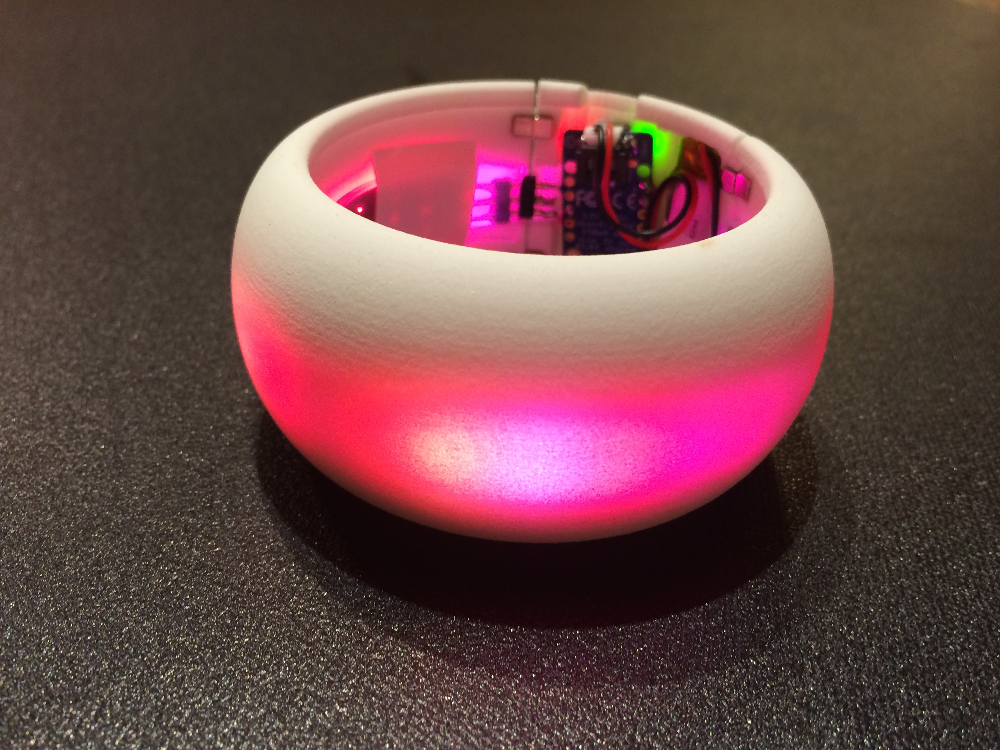

# LEDBracelet
Code for my Adafruit Trinket powered 21-LED bracelet!

Inspired by/3D models provided by: http://www.slickstreamer.info/2014/02/led-bracelet-accelerometer-3dprinting.html

Current samples are modified versions of tutorials from FastLED library linked below.

https://github.com/FastLED/FastLED

